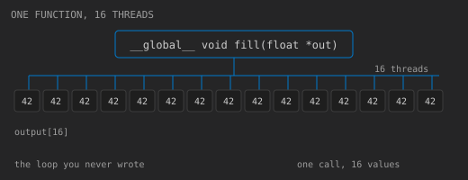

A kernel is an ordinary C function with one twist: **you do not run it once.**
clang compiles it to device code, and one *launch* turns that function into a grid
of threads — you say how many you want, and they all run the same body at the
same time. Each one is a *thread*, it knows its own index, and *it* is what picks
which cell of the output it is responsible for.

That is why `__global__` and the launch syntax below look unfamiliar. Everything
else in this file is plain C.



That picture is the *finished* program, not the one you start from: sixteen
threads, each writing `42.0f` into its own cell. Your copy asks for one thread
and writes nothing yet.

## The launch configuration is the loop

The three chevrons take two numbers: how many *blocks*, and how many *threads per
block*. Every thread you ask for runs the body once, and there is no loop to
write, because the parallelism is already there.

```cuda
__global__ void fill(float *out) {
  out[threadIdx.x] = 42.0f;   // one cell, one thread, no loop
}

fill<<<1, 16>>>(deviceOut);    // 1 block, 16 threads
```

A block is the unit the hardware actually schedules, and it is also the unit that
can share memory. For a one-dimensional launch, `threadIdx.x` counts `0 .. N-1`
across the block, so the total thread count is the product:

$$
N_{\text{threads}} = \text{gridDim.x} \times \text{blockDim.x} = 1 \times 16 = 16
$$

## What actually happens on Run


Compilation comes first: both halves are compiled and linked *before* `main` is
ever called. The launch configuration is an argument the running program passes,
not something the compiler gets to see.

The wait in the middle is there because a launch is asynchronous: `main` queues
the work and carries on, so the copy above would otherwise be free to run before
the threads had written anything. `cudaGetLastError()` reports and clears whatever
error the runtime has recorded, and `cudaDeviceSynchronize()` blocks until the
queue is empty, which is what makes the array safe to read back. Here the wait is
not decoration: delete it and all sixteen lines still read zero, because the
copy gets the buffer back before the threads have written to it. That is what a
missing wait looks like, and it is cheaper to see it now than to debug later.

Nothing crosses the bus per thread. On real hardware `cudaMalloc` and `cudaMemset`
work on the device, so there is no upload at all; this simulator approximates
`cudaMemset` by copying a host-side zero buffer across, which is one small transfer
real hardware would not have. The shape is the same either way: the array is
filled on the device and comes back exactly once, in the single device-to-host
copy at the end. Staying on the device is the biggest reason GPU
code is shaped the way it is — the work stays where the data already is.

## Your turn

Press **Run** first, before you change anything. You will get sixteen lines, every
one of them reading zero — one thread ran, its body is empty, so nothing
was written, and the array still holds the zeros `cudaMemset` put there.

Then make the two changes: ask for sixteen threads instead of one, and give the
kernel body a single line that writes `42.0f` to `out[threadIdx.x]` — this
thread's own cell. Run again and all sixteen lines read `42`.

One thing to notice while you are in there — hover `threadIdx` in the editor.
The simulator ships documentation for its built-ins, and this is the first one
you will meet many times.

```cuda
// The finished kernel, for comparison:
__global__ void fill(float *out) {
  out[threadIdx.x] = 42.0f;
}

fill<<<1, 16>>>(deviceOut);
```
